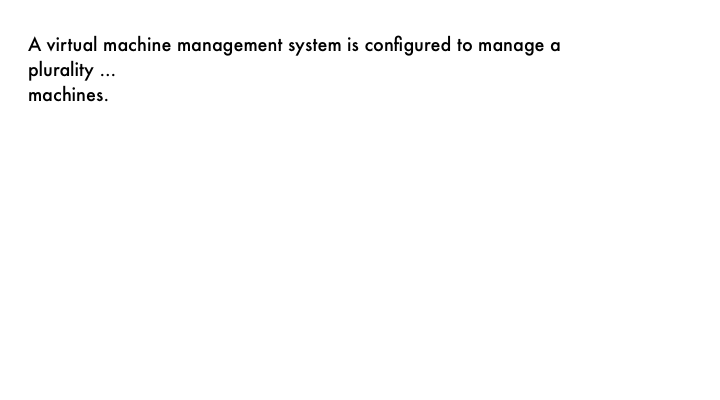

---
fontsize: 11pt
geometry: a4paper
title: Mixed Text and Image
...

A virtual machine management system is **configured** to manage a
plurality of computing systems each configured to support virtual
machines. The virtual management system is configured to transparently
manage the computing systems even in cases where the virtual machines
are supported by different hypervisors. In some embodiments, this
capability simplifies the management of cloud computing systems
including software provided by different virtual machine vendors.

